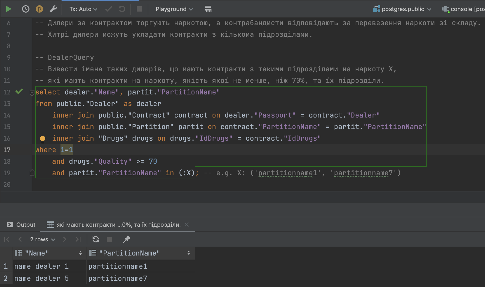
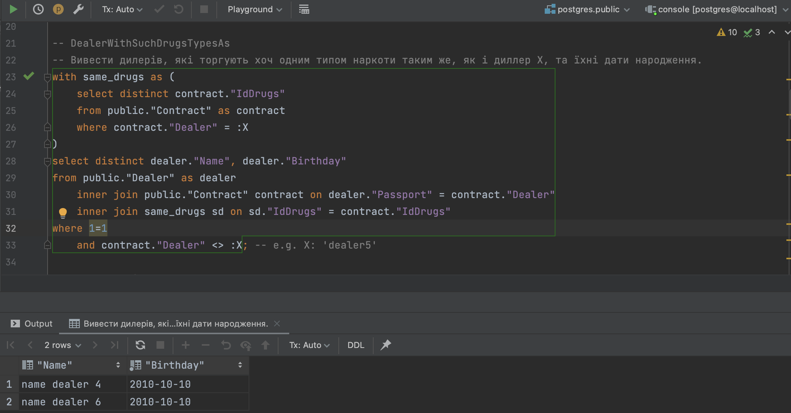
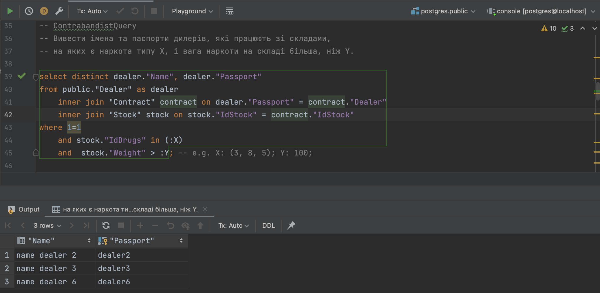
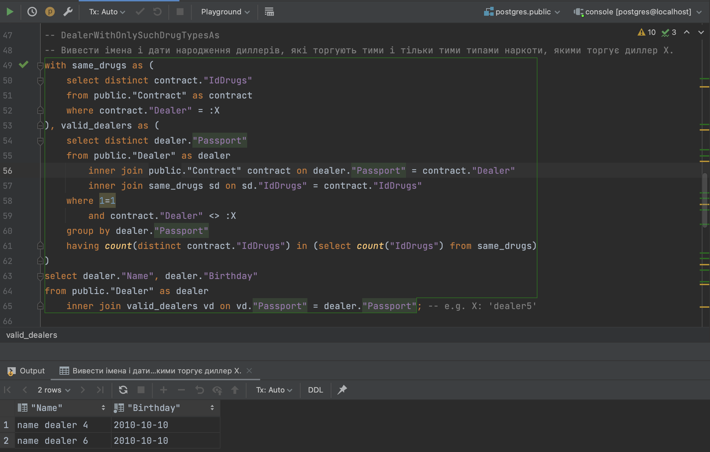
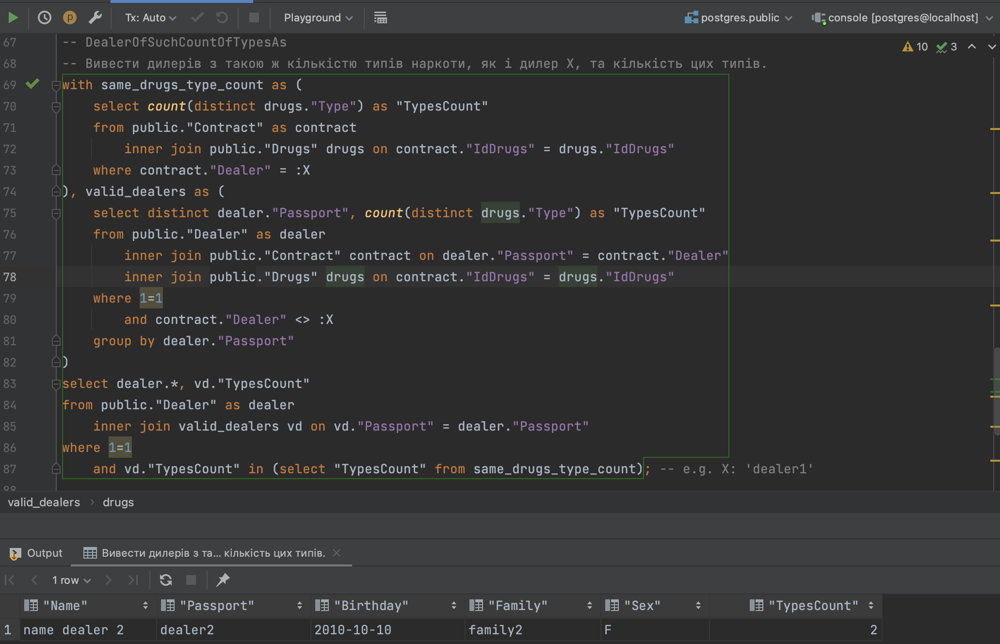
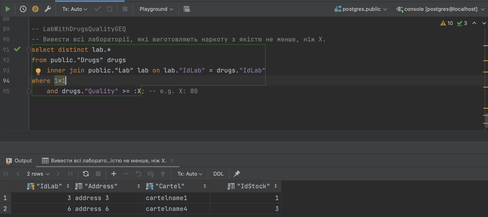

# DB Labs

## 01-lab

### Report

1. Setup PostgreSQL
'''bash
docker run --rm --name pg-docker -e POSTGRES_PASSWORD=cramstack@2018 -d -p 5432:5432 -v $HOME/docker/volumes/postgres:/var/lib/postgresql/data postgres
'''
2. DealerQuery

3. DealerWithSuchDrugsTypesAs

4. ContrabandistQuery

5. DealerWithOnlySuchDrugTypesAs

6. DealerOfSuchCountOfTypesAs

7. LabWithDrugsQualityGEQ

